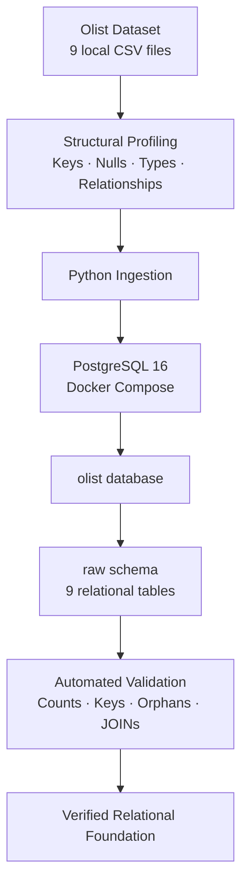
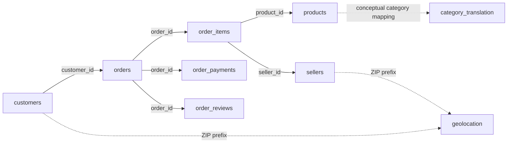

<div align="center">

# Olist Database Ingestion

### Assignment 01 · Qafza AI & Machine Learning Camp

**PostgreSQL · Docker · Python · SQL · Data Validation**

From raw relational CSV files to a reproducible and validated PostgreSQL database.

</div>

---

## Overview

This project implements the first hands-on assignment of the **Qafza AI & Machine Learning Camp**.

The objective is to take the **Brazilian E-Commerce Public Dataset by Olist**, understand its relational structure, load its nine CSV files into a real relational database, verify the relationships between the tables, and confirm that the resulting database can be queried reliably.

Rather than performing a manual one-time import, the project builds a reproducible ingestion workflow using **Docker, PostgreSQL, Python, and SQL**.

The result is a validated raw relational data layer that can serve as the foundation for later analysis, feature engineering, and machine learning work.

---

## Assignment Objective

The assignment focuses on four fundamental outcomes:

1. Understand the Olist tables and how they relate to one another.
2. Load the source CSV files into a local relational database.
3. Query the resulting tables and verify real relationships through SQL JOINs.
4. Establish a reliable database foundation for the work that follows in the MLOps track.

This assignment intentionally stops at the **database foundation**.

EDA, data cleaning, feature engineering, model training, and production ML are outside the scope of this task.

---

## Architecture



The source files remain local and unchanged. PostgreSQL runs inside Docker, while Python handles structural profiling, ingestion, and automated validation.

---

## Dataset

The project uses the **Brazilian E-Commerce Public Dataset by Olist**.

Unlike a ready-made machine learning spreadsheet, the dataset is distributed across multiple related CSV files representing different business entities and events.

| Raw table | Source file | Parsed records |
|---|---|---:|
| `customers` | `olist_customers_dataset.csv` | 99,441 |
| `geolocation` | `olist_geolocation_dataset.csv` | 1,000,163 |
| `order_items` | `olist_order_items_dataset.csv` | 112,650 |
| `order_payments` | `olist_order_payments_dataset.csv` | 103,886 |
| `order_reviews` | `olist_order_reviews_dataset.csv` | 100,000 |
| `orders` | `olist_orders_dataset.csv` | 99,441 |
| `products` | `olist_products_dataset.csv` | 32,951 |
| `sellers` | `olist_sellers_dataset.csv` | 3,095 |
| `category_translation` | `product_category_name_translation.csv` | 71 |

**Total parsed records: 1,551,698**

> The review file contains quoted text with embedded newline characters. For this reason, physical line counts do not equal CSV record counts. A CSV-aware parser correctly identifies **100,000 review records**.

The raw CSV files are intentionally **not committed to Git**. See [`data/README.md`](data/README.md) for dataset placement instructions.

---

## Relational Model

`raw.orders` is the central transactional table.



The solid relationships above are validated relational links supported by the observed data.

The dotted relationships are intentionally treated differently:

- Product category translation contains observed gaps and is therefore not enforced as a foreign key.
- Geolocation ZIP prefixes are highly duplicated, so ZIP-based relationships are conceptual rather than direct foreign-key constraints.

A detailed description of table grain, keys, relationships, nullability, and caveats is available in [`docs/data-model.md`](docs/data-model.md).

---

## Project Structure

```text
01-olist-database-ingestion/
│
├── README.md
├── .gitignore
├── .env.example
├── docker-compose.yml
├── requirements.txt
│
├── data/
│   └── README.md
│
├── docs/
│   └── data-model.md
│
├── scripts/
│   ├── db.py
│   ├── ingest.py
│   ├── profile_data.py
│   └── validate.py
│
└── sql/
    ├── schema.sql
    ├── smoke_tests.sql
    └── relationship_checks.sql
```

### Responsibilities

| Path | Purpose |
|---|---|
| `.env.example` | Safe template for local PostgreSQL configuration |
| `docker-compose.yml` | Reproducible PostgreSQL service |
| `data/README.md` | Raw dataset placement instructions |
| `docs/data-model.md` | Relational model and source-data caveats |
| `scripts/profile_data.py` | Read-only structural profiling of the CSV files |
| `scripts/ingest.py` | Reproducible PostgreSQL bulk ingestion |
| `scripts/validate.py` | Automated database and relationship validation |
| `scripts/db.py` | Shared database connection configuration |
| `sql/schema.sql` | PostgreSQL `raw` schema and table definitions |
| `sql/smoke_tests.sql` | Basic database and JOIN verification |
| `sql/relationship_checks.sql` | Orphan-key and relationship integrity checks |

---

## Database Design

The project uses:

```text
Database: olist
Schema:   raw
```

The `raw` schema intentionally preserves the semantics of the original source data.

Several schema decisions are based on the actual observed dataset rather than assumptions:

- IDs are stored as textual identifiers.
- ZIP-code prefixes use `CHAR(5)` to preserve leading zeros.
- Monetary values use exact `NUMERIC(12,2)` types.
- Coordinates use `DOUBLE PRECISION`.
- Source timestamps use `TIMESTAMP WITHOUT TIME ZONE`.
- Nullable source fields remain nullable.
- Original source column names are retained, including `product_name_lenght` and `product_description_lenght`.
- `geolocation` receives no artificial primary key.
- `order_reviews` receives no artificial primary key because `review_id` is not unique in the observed source data.
- Only relationships supported by the profiled dataset are enforced as foreign keys.

---

## Structural Profiling

Before designing the database schema, the source files are profiled without modifying them.

The profiling process checks:

- CSV structure
- Parsed row counts
- Missing values
- Candidate-key uniqueness
- Composite-key uniqueness
- Numeric parseability
- Timestamp parseability
- ZIP-code behavior
- Relationship integrity
- Orphan keys
- Review duplication behavior

Run:

```bash
python scripts/profile_data.py
```

For machine-readable output:

```bash
python scripts/profile_data.py --json
```

### Important Findings

The source-data inspection revealed several important characteristics:

- All nine CSV files parse without malformed records.
- All observed non-empty numeric values parse successfully.
- All observed non-empty timestamps parse successfully.
- ZIP prefixes are exactly five characters and frequently begin with `0`.
- Geolocation contains **1,000,163 records but only 19,015 distinct ZIP prefixes**.
- One geolocation ZIP prefix appears up to **1,146 times**.
- `review_id` is not unique.
- Some orders contain multiple review records.
- Review title and message fields contain substantial missing values.
- Several optional order timestamps contain source nulls.
- Product attributes also contain legitimate source nulls.
- Product-category translation is incomplete for a small number of product records.

These findings directly inform the PostgreSQL schema rather than being hidden or silently corrected.

---

## Prerequisites

Before running the project, make sure you have:

- Docker
- Docker Compose
- Python 3.12 or compatible Python 3
- The nine original Olist CSV files

The dataset files must be placed under:

```text
data/raw/
```

See [`data/README.md`](data/README.md) for the expected filenames.

---

## Quick Start

From the assignment directory:

### 1. Create the Python environment

```bash
python3 -m venv .venv
source .venv/bin/activate
pip install -r requirements.txt
```

### 2. Create local environment configuration

```bash
cp .env.example .env
```

The real `.env` file is ignored by Git.

### 3. Profile the raw source

```bash
python scripts/profile_data.py
```

### 4. Start PostgreSQL

```bash
docker compose up -d --wait
```

### 5. Ingest the dataset

```bash
python scripts/ingest.py
```

### 6. Validate the result

```bash
python scripts/validate.py
```

A successful run ends with:

```text
VALIDATION PASSED
```

---

## Ingestion Strategy

The ingestion process is designed to be repeatable and efficient.

Before loading data, it:

1. Confirms that all nine required CSV files exist.
2. Connects to PostgreSQL using local environment configuration.
3. Recreates the assignment's `raw` schema from `sql/schema.sql`.
4. Streams each CSV file into its corresponding PostgreSQL table.
5. Uses PostgreSQL `COPY` rather than row-by-row inserts.
6. Preserves CSV quoting, embedded newlines, empty fields, and original values.
7. Rolls back failed loads instead of leaving a partially refreshed dataset.

Using PostgreSQL `COPY` is especially important for the geolocation source, which contains more than one million records.

---

## Validation

The project does not consider ingestion successful merely because the script finishes.

`validate.py` verifies:

- PostgreSQL connectivity
- Presence of all nine expected tables
- Exact source-to-database row counts
- Supported candidate-key behavior
- Expected review-key duplication
- Important relational integrity checks
- Orders-to-customers JOIN completeness

Verified database counts:

| Table | Rows |
|---|---:|
| `raw.customers` | 99,441 |
| `raw.geolocation` | 1,000,163 |
| `raw.order_items` | 112,650 |
| `raw.order_payments` | 103,886 |
| `raw.order_reviews` | 100,000 |
| `raw.orders` | 99,441 |
| `raw.products` | 32,951 |
| `raw.sellers` | 3,095 |
| `raw.category_translation` | 71 |

Core relationship checks returned **zero orphan rows** for:

- Orders → Customers
- Order Items → Orders
- Order Items → Products
- Order Items → Sellers
- Order Payments → Orders
- Order Reviews → Orders

The source also contains **13 product records with categories that do not have a matching English translation**. This is documented rather than silently modified.

---

## SQL Verification

Run the supplied SQL smoke tests:

```bash
docker compose exec -T postgres sh -c \
  'psql -U "$POSTGRES_USER" -d "$POSTGRES_DB" -f /dev/stdin' \
  < sql/smoke_tests.sql
```

Run relationship checks:

```bash
docker compose exec -T postgres sh -c \
  'psql -U "$POSTGRES_USER" -d "$POSTGRES_DB" -f /dev/stdin' \
  < sql/relationship_checks.sql
```

Or open an interactive PostgreSQL session:

```bash
docker compose exec postgres sh -c \
  'psql -U "$POSTGRES_USER" -d "$POSTGRES_DB"'
```

---

## Example JOIN

A core requirement of the assignment is proving that related tables can be queried together.

For example:

```sql
SELECT
    o.order_id,
    o.order_status,
    o.order_purchase_timestamp,
    c.customer_unique_id,
    c.customer_city,
    c.customer_state
FROM raw.orders AS o
JOIN raw.customers AS c
    ON c.customer_id = o.customer_id
ORDER BY o.order_id
LIMIT 10;
```

This relationship has been validated across the complete dataset.

---

## Engineering Decisions

### Raw means raw

This assignment intentionally avoids transforming the source into a cleaned ML-ready dataset.

The database preserves source semantics and values so that future stages can make cleaning and feature-engineering decisions explicitly.

### No blind ZIP foreign keys

Customer and seller ZIP prefixes conceptually relate to geolocation data, but geolocation contains many records for the same ZIP prefix.

A direct foreign-key model would therefore misrepresent the actual source structure.

### No invented keys

A database schema should describe observed data rather than force idealized assumptions onto it.

For this reason:

- `geolocation` has no invented primary key.
- `order_reviews` has no invented primary key.

### Exact money types

Prices, freight values, and payment values use exact decimal types instead of binary floating-point storage.

### One-to-many relationships remain separate

Items, payments, and reviews have different grains.

Joining them all directly can multiply rows and duplicate monetary values. Any future one-row-per-order ML table should aggregate these relations independently before joining.

---

## Future ML Context

The broader training scenario ultimately considers **late-delivery classification**: predicting whether an order will arrive late or on time.

This database provides the historical source layer for that future work.

However, future model construction must distinguish between:

- data available at prediction time, and
- information that only becomes known after an order progresses or is delivered.

For example, actual delivery timestamps and customer review information are valid historical database fields, but they may cause **data leakage** if used as prediction-time features.

That decision belongs to later feature engineering and modeling tasks—not this assignment.

---

## Out of Scope

The following are intentionally not part of Assignment 01:

- Exploratory Data Analysis
- Data cleaning
- Feature engineering
- Order-level ML-table construction
- Model training
- Model evaluation
- APIs
- DVC
- MLflow
- Monitoring
- Orchestration
- Deployment

Keeping these concerns out of this assignment preserves a clear boundary around the database-foundation task.

---

## Stop the Database

Stop PostgreSQL while keeping the persistent Docker volume:

```bash
docker compose stop
```

To start it again:

```bash
docker compose up -d --wait
```

---

<div align="center">

**Assignment 01 · Completed**

A reproducible relational foundation for the Olist dataset.

</div>
