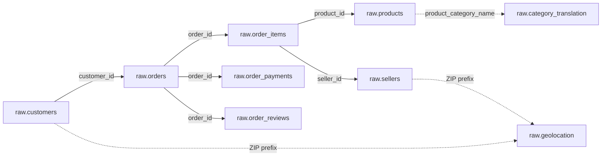

# Olist Raw Data Model

This document describes the relational structure used by **Assignment 01 — Olist Database Ingestion**.

The model is based on structural profiling of the actual source CSV files. Keys and constraints reflect observed source behavior rather than assumptions about an idealized e-commerce schema.

---

## Model Overview

The PostgreSQL database uses:

```text
Database: olist
Schema:   raw
```

`raw.orders` acts as the central transactional table, with related customer, item, payment, review, product, and seller data stored at their original grains.

---

## Relationship Diagram



### Relationship Types

**Solid connections** represent relationships supported by the profiled source data and enforced where appropriate.

**Dotted connections** represent conceptual relationships that are intentionally not implemented as foreign keys because of source-data characteristics.

---

## Table Grain

Understanding the grain of each table is essential before writing JOINs or building future machine learning datasets.

| Table | Grain | Identifier / Constraint | Rows |
|---|---|---|---:|
| `raw.customers` | One order-specific customer record | `customer_id` primary key | 99,441 |
| `raw.geolocation` | One source geolocation observation | No primary key | 1,000,163 |
| `raw.orders` | One order | `order_id` primary key | 99,441 |
| `raw.order_items` | One numbered item within an order | `(order_id, order_item_id)` primary key | 112,650 |
| `raw.order_payments` | One payment sequence within an order | `(order_id, payment_sequential)` primary key | 103,886 |
| `raw.order_reviews` | One source review record | No primary key | 100,000 |
| `raw.products` | One product | `product_id` primary key | 32,951 |
| `raw.sellers` | One seller | `seller_id` primary key | 3,095 |
| `raw.category_translation` | One Portuguese category translation | `product_category_name` primary key | 71 |

---

# Core Tables

## `raw.orders`

**Grain:** one order.

Primary key:

```text
order_id
```

The table contains the main order lifecycle, including:

- purchase timestamp,
- approval timestamp,
- carrier delivery timestamp,
- customer delivery timestamp,
- estimated delivery timestamp,
- and order status.

`customer_id` links each order to its customer record.

### Relationship

```text
raw.orders.customer_id
        ↓
raw.customers.customer_id
```

Profiling found no orphan customer references.

---

## `raw.customers`

**Grain:** one order-specific customer record.

Primary key:

```text
customer_id
```

The table also contains:

```text
customer_unique_id
```

These fields should not be treated as interchangeable.

`customer_id` is the identifier used by the orders table, while `customer_unique_id` represents the underlying customer identity across the dataset.

ZIP prefixes remain textual because leading zeros are meaningful.

---

## `raw.order_items`

**Grain:** one numbered item within an order.

Composite primary key:

```text
(order_id, order_item_id)
```

Each record may contain:

- product identifier,
- seller identifier,
- shipping limit,
- item price,
- freight value.

Relationships:

```text
order_items.order_id
        ↓
orders.order_id
```

```text
order_items.product_id
        ↓
products.product_id
```

```text
order_items.seller_id
        ↓
sellers.seller_id
```

Profiling found zero orphan records across all three relationships.

---

## `raw.order_payments`

**Grain:** one payment sequence associated with an order.

Composite primary key:

```text
(order_id, payment_sequential)
```

A single order may contain multiple payment records.

Relationship:

```text
order_payments.order_id
        ↓
orders.order_id
```

No orphan payment-to-order references were observed.

---

## `raw.order_reviews`

**Grain:** one source review record.

The table intentionally has **no primary key**.

Although `review_id` initially appears to be a natural key, profiling showed:

```text
Total review records:          100,000
Distinct review_id values:      99,173
Repeated review_id values:         802
Excess duplicate records:          827
```

The relationship with orders also contains legitimate one-to-many behavior:

```text
Distinct order_id values:       99,441
Orders with multiple reviews:      555
Maximum reviews for one order:       3
```

Therefore neither `review_id` nor `order_id` is forced into an artificial uniqueness constraint.

Relationship:

```text
order_reviews.order_id
        ↓
orders.order_id
```

No orphan review-to-order references were observed.

---

## `raw.products`

**Grain:** one product.

Primary key:

```text
product_id
```

The raw schema intentionally preserves the original source column names:

```text
product_name_lenght
product_description_lenght
```

The spelling is not corrected in the raw layer because the goal is to preserve source semantics.

Some product attributes contain source nulls and remain nullable.

---

## `raw.sellers`

**Grain:** one seller.

Primary key:

```text
seller_id
```

The table contains seller location information, including a five-character ZIP-code prefix.

Relationship with order items:

```text
order_items.seller_id
        ↓
sellers.seller_id
```

No orphan seller references were observed.

---

## `raw.geolocation`

**Grain:** one source geolocation observation.

No primary key is imposed.

The dataset contains:

```text
Total geolocation records:   1,000,163
Distinct ZIP prefixes:          19,015
```

Most ZIP prefixes appear multiple times, and one prefix appears up to:

```text
1,146 records
```

Therefore:

```text
geolocation_zip_code_prefix
```

is **not unique** and cannot serve as a primary key.

Customer and seller ZIP prefixes conceptually relate to this table, but a direct relational foreign key would not correctly represent the source structure.

Joining geolocation directly by ZIP without prior aggregation can also multiply rows.

---

## `raw.category_translation`

**Grain:** one Portuguese product-category translation.

Primary key:

```text
product_category_name
```

The table maps Portuguese category names to English names.

However, profiling found:

```text
13 product records
```

across two non-null category names that have no matching translation.

For this reason, the project intentionally does **not** enforce:

```text
products.product_category_name
    →
category_translation.product_category_name
```

as a foreign key.

The source discrepancy is documented rather than silently corrected.

---

# Validated Relationships

The following relationships were tested against the complete source dataset:

| Child | Parent | Orphan Rows |
|---|---|---:|
| `orders.customer_id` | `customers.customer_id` | 0 |
| `order_items.order_id` | `orders.order_id` | 0 |
| `order_items.product_id` | `products.product_id` | 0 |
| `order_items.seller_id` | `sellers.seller_id` | 0 |
| `order_payments.order_id` | `orders.order_id` | 0 |
| `order_reviews.order_id` | `orders.order_id` | 0 |

These relationships are safe to represent through foreign-key constraints in the raw relational model.

---

# Source Data Characteristics

## ZIP Prefixes

All observed ZIP-prefix values contain exactly five characters.

Leading-zero records occur frequently:

| Source | Rows beginning with `0` |
|---|---:|
| Customers | 23,995 |
| Geolocation | 245,733 |
| Sellers | 1,027 |

For this reason, ZIP prefixes are stored as:

```sql
CHAR(5)
```

rather than numeric values.

A value such as:

```text
09790
```

must remain `09790`, not `9790`.

---

## Review Text and CSV Parsing

Review comments may contain embedded newline characters inside valid quoted CSV fields.

As a result:

```text
Physical data lines: 105,759
Parsed CSV records:  100,000
```

Physical newline counting is therefore not a reliable method for determining record counts in this file.

The project uses CSV-aware parsing and PostgreSQL `COPY`.

---

## Missing Review Content

Missing values observed in the review source include:

| Field | Missing Records |
|---|---:|
| `review_comment_title` | 88,285 |
| `review_comment_message` | 58,245 |

These fields remain nullable.

Missing comments do not imply a malformed record.

---

## Optional Order Timestamps

Observed source nulls include:

| Field | Missing Records |
|---|---:|
| `order_approved_at` | 160 |
| `order_delivered_carrier_date` | 1,783 |
| `order_delivered_customer_date` | 2,965 |

These timestamps therefore remain nullable in the raw schema.

---

## Product Attributes

Several product-description-related fields contain missing values, and a small number of physical-dimension values are also absent.

The raw layer preserves these source nulls rather than imputing or cleaning them.

---

# Join Safety

A major characteristic of the dataset is that several tables have a **one-to-many relationship with orders**.

For example:

```text
orders
  │
  ├── order_items
  ├── order_payments
  └── order_reviews
```

These tables have different grains.

A direct join such as:

```text
orders
  JOIN order_items
  JOIN order_payments
  JOIN order_reviews
```

may multiply rows.

For example, an order with:

```text
2 items
3 payments
2 reviews
```

could produce:

```text
2 × 3 × 2 = 12 rows
```

for the same original order.

This can duplicate prices, freight values, payments, and other quantities.

A future one-row-per-order analytical or ML dataset should therefore aggregate each one-to-many relation independently before combining them.

---

# Raw-Layer Principles

The `raw` schema follows several principles:

### Preserve source semantics

Original values and column names are retained wherever practical.

### Do not silently clean

Missing values, duplicate source behavior, and translation gaps are preserved and documented.

### Use evidence-based constraints

Primary keys, foreign keys, and nullability rules are based on actual profiling results.

### Preserve identifiers correctly

IDs and ZIP prefixes are stored as identifiers rather than arithmetic quantities.

### Separate ingestion from future modeling

This schema is a relational source layer, not an ML feature table.

---

# Future ML Considerations

The broader training scenario considers predicting whether an order will arrive **late or on time**.

A future modeling dataset will likely require:

```text
one row per order
```

That transformation is deliberately outside the scope of this assignment.

Items, payments, and reviews should first be aggregated separately before being joined to orders.

---

## Prediction-Time Leakage

The raw database intentionally contains historical fields that would not necessarily be available when a future prediction is made.

Examples include:

- actual customer delivery timestamp,
- review score,
- review comments,
- review creation information.

These fields are valid raw historical data.

However, they may create **data leakage** if used as features for a model intended to predict late delivery at purchase time.

The raw database should preserve them; the feature-engineering stage must decide whether they are valid inputs.

---

# Scope Boundary

This document describes the relational source layer created in Assignment 01.

It does **not** define:

- cleaned analytical tables,
- feature-engineered datasets,
- ML training tables,
- model inputs,
- model evaluation,
- or production-serving schemas.

Those decisions belong to later stages of the training workflow.
